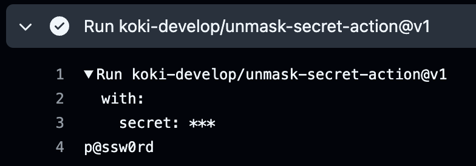

# Unmask Secret Action

[](https://github.com/koki-develop/unmask-secret-action/releases/latest)
[](https://github.com/koki-develop/unmask-secret-action/actions/workflows/ci.yml)
[](https://github.com/koki-develop/unmask-secret-action/actions/workflows/build.yml)

Unmask a secret value.

## Usage

```yaml
- uses: koki-develop/unmask-secret-action@v1
  with:
    secret: ${{ secrets.SOME_SECRET }}
```



## LICENSE

[MIT](./LICENSE)
